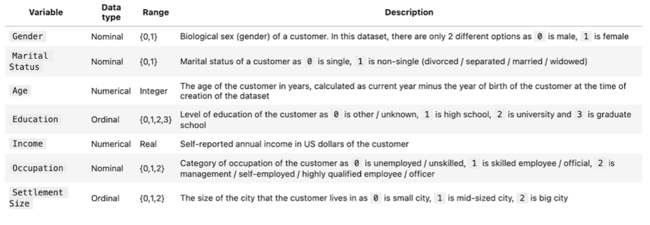
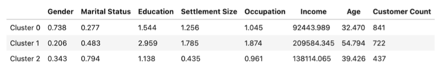
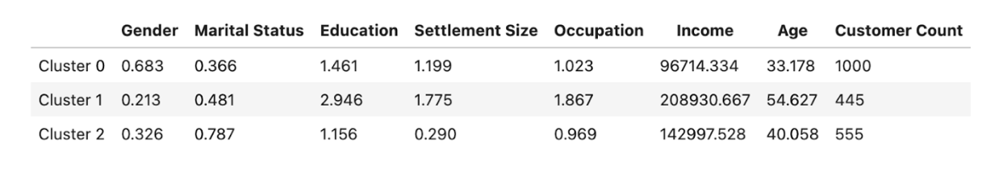

# Project Background

This project applies customer segmentation techniques to loyalty card data collected at checkout. The dataset includes demographic and socioeconomic attributes for 2,000 customers, such as age, income, gender, education, occupation, marital status, and settlement size.

The objective is to identify distinct customer groups using clustering methods in order to support data-driven marketing strategies. By understanding differences across segments, the business can improve targeted campaigns, increase customer retention, and better identify high-value customers.

The primary business metric guiding this analysis is **Customer Retention Rate**, which measures the percentage of customers who return to make repeat purchases and reflects long-term loyalty and satisfaction.

# Data Structure & Initial Checks

The dataset includes various attributes such as age, income, gender, education, occupation, marital status, and settlement size for 2,000 customers. This information has been collected through the loyalty cards used at checkout, providing a comprehensive view of customer characteristics.

The Python queries used to inspect and clean the data for this analysis can be found here [EDA notebook](EDA.ipynb).

# Executive Summary

### Overview of Findings

To achieve our purpose, the clustering methods used in this report are the Elbow Method, K- means++, and Agglomerative Clustering. The Elbow Method determines the optimal number of customer segments by plotting the relationship between the number of clusters and the explained variance. K-means++ efficiently assigns customers to clusters, while Agglomerative Clustering groups customers based on their similarities.

The Python queries used can be found here [Customer Segmentation](Customer Segmentation.ipynb). 

# Customer Segmentation
### 1. Choosing the optimal number of clusters using the Elbow Method

The Elbow Curve was created using **Elbow Method**. The **"elbow" point** in the chart indicates **three clusters** as the ideal segmentation for gaining valuable insights into our marketing strategies.

### 2. Estimate the clusters using K-means++ Clustering

This table presents the KMeans++ clustering results, showing the average values for 7 variables across three clusters. The customer count column indicates how many customers fall into each cluster, with distinct profiles based on these attributes.

**Interpretation of Clusters:**

- **Cluster 0 (841 customers)**: This cluster represents younger (with an average age of 32.47 years), primarily single, lower-income females ($92,444 average) with high school education, mostly living in mid-sized cities, and working in skilled or unskilled occupations.
- **Cluster 1 (722 customers)**: This cluster consists of older (54.79 years old average), highly educated males in managerial or highly skilled positions, living in large cities, with very high incomes (at $209,584 average).
- **Cluster 2 (437 customers)**: This cluster represents middle-aged (average 39.43 years), primarily non-single, high-school educated females, working in skilled positions, living in smaller cities, with moderate incomes ($138,114 average).

### 3. Estimate the clusters using Agglomerative Clustering

**Interpretation of Clusters:**

- **Cluster 0 (1000 customers)**: This cluster represents younger (with an average age of 33.18 years), single, mainly female customers with high school education, living in mid-sized cities, and working in skilled occupations with lower incomes ($96,714 average).
- **Cluster 1 (445 customers)**: This cluster consists of older (54.63 years old average), highly educated males in highly skilled or managerial roles, living in larger cities with high incomes (average $208,931).
- **Cluster 2 (555 customers)**: This cluster represents middle-aged (with an average age of 40.06 years), non-single, high-school educated females living in smaller cities, working in skilled jobs with moderate incomes ($142,998 average).

### Comparison of Clusters (K-means++ vs Agglomerative Clustering):

Both K-means++ and Agglomerative Clustering identify similar customer segments with overlapping profiles. However, customer counts per cluster vary moderately. Despite slight differences in cluster centers due to the algorithms' optimization methods, the overall insights into customer groups remain consistent. Thus, both techniques effectively capture distinct segments, providing reliable analysis for further exploration.

# Recommendations:

To strengthen marketing performance, it is crucial to understand the distinct characteristics of each customer segment. By aligning strategies with the specific needs and behaviours of these groups, businesses can drive higher engagement, improve customer satisfaction, and allocate resources more effectively. Based on the analysis, I recommend that the marketing team segment customers into the following groups:

**1. Group 1 (Younger Single Female)**: This group is price-sensitive and active on social media. Effective strategies include **influencer campaigns** on platforms like Instagram and TikTok, along with **subscription boxes** featuring affordable, trendy products. **Community events** in mid-sized cities can foster brand loyalty.

**2. Group 2 (Older Highly Educated Males)**: With a preference for exclusivity, this segment values premium products and experiences. Marketing should focus on luxury goods, high-end technology, and **networking events** in major cities. **Personalized recommendations** based on purchase history will reinforce their connection to the brand.

**3. Group 3 (Middle-Aged Non-Single Females)**: **Family-oriented campaigns** are effective for this group. Highlighting products for home improvement, health, and education, along with **loyalty programs** and relevant **email content**, can maintain their engagement and encourage repeat purchases.
